# ft_irc — Networking Internals (Subject-Verified Edition)

**Part of the networking documentation suite** — [← Back to main pipeline](01_WORKFLOW_PIPELINE.md)

> **⚠️ CRITICAL COMPLIANCE NOTES FOR ft_irc SUBJECT (v10.0)**  
> This document is aligned with the official ft_irc subject requirements and actual implementation.  
> See embedded [VERIFICATION] markers for compliance details.

---

## Table of Contents

1. [Event-based I/O vs Busy Loop](#1-event-based-io-vs-busy-loop)
2. [How poll() Works](#2-how-poll-works)
3. [Hardware Interrupt Chain](#3-hardware-interrupt-chain)
4. [IPv4 Socket — Current Implementation](#4-ipv4-socket--current-implementation)
5. [IPv6 Dual-Stack — What It Would Take](#5-ipv6-dual-stack--what-it-would-take)
6. [Acronym Etymology](#6-acronym-etymology)
7. **[Subject Compliance Checklist](#7-subject-compliance-checklist)** ⭐ NEW

---

## 1. Event-based I/O vs Busy Loop

### Busy Loop (forbidden in ft_irc)

```cpp
while (true) {
    for (each client) {
        recv(fd, buf, ...);   // returns EAGAIN 99% of the time
        send(fd, buf, ...);   // wastes CPU on every silent client
    }
}
```

The server visits every file descriptor on every iteration regardless of whether
anything happened. With 50+ clients, 49 calls return `EAGAIN` and burn CPU for nothing.
The subject explicitly prohibits this: any `read`/`recv` or `write`/`send` without
`poll()` (or equivalent) results in a grade of **0**.

**[VERIFICATION]** Subject § IV.1:
> "if you attempt to read/recv or write/send in any file descriptor without using poll() 
> (or equivalent), your grade will be 0."

This is the **most critical requirement** in the entire project.

### Event-based (required approach)

```cpp
while (true) {
    int n = poll(fds, nfds, -1);  // sleeps until something happens
    for (int i = 0; i < nfds; i++) {
        if (fds[i].revents & POLLIN)  handleRead(fds[i].fd);
        if (fds[i].revents & POLLOUT) handleWrite(fds[i].fd);
        if (fds[i].revents & POLLHUP) closeClient(fds[i].fd);
    }
}
```

The process is put to sleep by the OS. The CPU is freed entirely. The kernel wakes
the process only when at least one file descriptor has a real event. Work happens
exclusively in response to actual I/O — not in anticipation of it.

**[IMPLEMENTATION NOTE]** Our implementation uses `poll(fds, nfds, 1000)` (1-second timeout)
instead of `-1` (infinite). This is functionally correct for signal handling, but see [Details](#timeout-vs-signal-handling) below.

### Key difference

| | Busy Loop | Event-based |
|---|---|---|
| CPU while idle | 100% | ~0% |
| Scales to N clients | O(N) wasted calls | O(events) actual work |
| Allowed in ft_irc | No — grade 0 | Yes |

---

## 2. How poll() Works

### The `pollfd` struct

```c
struct pollfd {
    int   fd;       // file descriptor to watch
    short events;   // what YOU want to watch (set before poll())
    short revents;  // what the OS actually saw (set after poll())
};
```

`events` and `revents` are distinct on purpose. You declare intent; the kernel reports
reality. After `poll()` returns, **always** check `revents`, not `events`.

### Setting up the watch list

```cpp
std::vector<struct pollfd> fds;

// Server socket — watch for incoming connections
struct pollfd serverEntry;
serverEntry.fd     = serverSocketFd_;
serverEntry.events = POLLIN;
fds.push_back(serverEntry);

// Client socket — watch for incoming data
struct pollfd clientEntry;
clientEntry.fd     = clientFd;
clientEntry.events = POLLIN;
fds.push_back(clientEntry);
```

### The event loop

```cpp
while (true) {
    int n = poll(fds.data(), fds.size(), -1);  // -1 = block forever
    if (n < 0) throw std::runtime_error("poll failed");

    for (size_t i = 0; i < fds.size(); i++) {
        if (!fds[i].revents) continue;  // nothing happened on this fd

        if (fds[i].revents & POLLIN) {
            if (fds[i].fd == serverSocketFd_)
                acceptNewClient();
            else
                readFromClient(fds[i].fd);
        }
        if (fds[i].revents & POLLHUP || fds[i].revents & POLLERR)
            disconnectClient(fds[i].fd);
    }
}
```

Poll IRC Mechanism Diagram:



### poll() flag reference

| Flag | Meaning | Typical action |
|---|---|---|
| `POLLIN` | Data is ready to read | Call `recv()` |
| `POLLOUT` | Send buffer has space | Call `send()` |
| `POLLERR` | Error on the descriptor | Close and clean up |
| `POLLHUP` | Remote end closed connection | Close and clean up |
| `POLLPRI` | Out-of-band / priority data | Rarely used in IRC |

> **Note:** `poll()`, `select()`, `kqueue()`, and `epoll()` are all valid equivalents
> per the ft_irc subject. The logic above applies equally to all of them.

**[VERIFICATION]** Subject § IV.1:
> "Even though poll() is mentioned in the subject and the evaluation scale, you may use 
> any equivalent such as select(), kqueue(), or epoll()."

---

## 3. Hardware Interrupt Chain

This is what actually happens from the moment a TCP packet arrives until
`poll()` call returns. There is **no polling loop at any level** — not in irc
code, not in the kernel, not in the hardware.

Hardware Interrupt Chain Diagram:



### Full chain: packet → poll() wakes up

```
Internet
   │
   │  TCP packet
   ▼
┌─────────────────────────────────────────────────────┐
│  HARDWARE LAYER                                     │
│                                                     │
│  NIC receives packet via DMA (no CPU involved yet)  │
│  NIC raises voltage on IRQ wire (e.g. IRQ11)        │
│  CPU detects signal between instructions → stops    │
└─────────────────────────────────────────────────────┘
   │
   │  hardware interrupt
   ▼
┌─────────────────────────────────────────────────────┐
│  KERNEL LAYER                                       │
│                                                     │
│  CPU saves: PC, registers, flags → stack (RAM)      │
│  CPU reads IDT[32 + irq_number] → ISR address       │
│  ISR runs: copies data to socket recv buffer        │
│  ISR marks fd as readable in wait queue             │
│  Scheduler: moves ircserv SLEEPING → RUNNABLE       │
└─────────────────────────────────────────────────────┘
   │
   │  next CPU time slice
   ▼
┌─────────────────────────────────────────────────────┐
│  YOUR PROCESS                                       │
│                                                     │
│  poll() returns, revents = POLLIN set               │
│  recv(fd, buf, ...) reads the data                  │
└─────────────────────────────────────────────────────┘
```

### Key components

**IRQ (Interrupt Request)**
A physical voltage signal on a wire between the NIC and the CPU's interrupt
controller (APIC). Not a software call — a hardware signal. The NIC raises the
line; the CPU detects it between the current and next instruction.

**IDT (Interrupt Descriptor Table)**
A fixed array in RAM, populated at kernel boot time. Each entry maps an IRQ
number to the memory address of its handler function (ISR). The CPU does not
search for the handler — it directly reads `IDT[32 + irq_number]` and jumps.

**ISR (Interrupt Service Routine)**
A kernel function (the NIC driver) that runs when the CPU jumps to the address
from the IDT. It copies the packet from the NIC's DMA buffer into the socket's
receive buffer in kernel memory, then marks the file descriptor as readable.

**DMA (Direct Memory Access)**
The NIC copies packet data into RAM by itself, over a dedicated bus, without
involving the CPU at all. The CPU only enters the picture after the data is
already in memory.

**State save / restore**
When an interrupt fires, the CPU automatically pushes the Program Counter,
all general-purpose registers, CPU flags, and stack pointer onto the stack.
The interrupted process is frozen perfectly and knows nothing about it.
When the scheduler returns that process to the CPU, it resumes from the
exact instruction where it was paused.

---

## 4. IPv4 Socket — Current Implementation

```cpp
void Server::createServerSocket() {
    serverSocketFd_ = socket(AF_INET, SOCK_STREAM, 0);
    if (serverSocketFd_ < 0)
        throw std::runtime_error("socket failed");

    int opt = 1;
    setsockopt(serverSocketFd_, SOL_SOCKET, SO_REUSEADDR, &opt, sizeof(opt));
}
```

### What each argument means

```
socket(AF_INET, SOCK_STREAM, 0)
       │        │             │
       │        │             └─ protocol: 0 = auto-select (TCP for STREAM)
       │        └─ type: SOCK_STREAM = reliable, ordered, connection-based (TCP)
       └─ address family: AF_INET = IPv4, 32-bit addresses
```

`AF_INET` is a compile-time constant equal to `2` in the kernel. It selects the
IPv4 address family, meaning all addresses are 32-bit (4 bytes), written as four
octets: `192.168.1.5`.

### Why `SO_REUSEADDR`

Without this option, after the server stops, the kernel keeps the port in
`TIME_WAIT` state for up to 2 minutes (TCP's graceful close window). Any attempt
to restart the server and `bind()` to the same port fails with
`"Address already in use"`. `SO_REUSEADDR` lets the socket reuse the address
immediately.

### bind and listen (completing the setup)

```cpp
struct sockaddr_in addr;
memset(&addr, 0, sizeof(addr));
addr.sin_family      = AF_INET;
addr.sin_addr.s_addr = INADDR_ANY;   // accept on all network interfaces
addr.sin_port        = htons(port_); // host byte order → network byte order

if (bind(serverSocketFd_, (struct sockaddr*)&addr, sizeof(addr)) < 0)
    throw std::runtime_error("bind failed");

if (listen(serverSocketFd_, SOMAXCONN) < 0)
    throw std::runtime_error("listen failed");
```

This is the correct and sufficient implementation for ft_irc. 

**[VERIFICATION]** Subject § IV.1:
> "Communication between client and server has to be done via TCP/IP (v4 or v6)."

Our implementation uses **IPv4 (AF_INET)**, which fully satisfies this requirement.
The subject accepts either v4 or v6 — this is correct.

### Accepting new client connections

```cpp
void Server::handleNewConnection() {
    struct sockaddr_in clientAddr;
    socklen_t clientLen = sizeof(clientAddr);

    int clientFd = accept(serverSocketFd_,
                          (struct sockaddr*)&clientAddr,
                          &clientLen);
    if (clientFd < 0) {
        if (errno == EAGAIN || errno == EWOULDBLOCK)
            return;  // No incoming connection yet
        throw std::runtime_error("accept failed");
    }

    setNonBlocking(clientFd);
    
    // Extract client IP address
    std::string hostname = inet_ntoa(clientAddr.sin_addr);
    
    Client* client = new Client(clientFd);
    client->setHostname(hostname);
    clients_[clientFd] = client;
}
```

**[IMPORTANT]** The code uses `inet_ntoa()` to extract the client's IP address.
See [inet_ntoa vs inet_ntop](inet_ntoa_vs_ntop.md) below.

### Non-blocking I/O requirement

```cpp
void Server::setNonBlocking(int fd) {
    if (fcntl(fd, F_SETFL, O_NONBLOCK) < 0)
        throw std::runtime_error("fcntl O_NONBLOCK failed");
}
```

**[VERIFICATION]** Subject § IV.1:
> "All I/O operations must be non-blocking."

And § IV.2 (MacOS):
> "you are permitted to use fcntl() **only** as follows: `fcntl(fd, F_SETFL, O_NONBLOCK);`  
> Any other flag is forbidden."

Our implementation matches this exactly — we only use `F_SETFL` with `O_NONBLOCK`.

---

## 5. IPv6 Dual-Stack — What It Would Take

### What dual-stack means

A single socket with `AF_INET6` and `IPV6_V6ONLY = 0` accepts connections from
both IPv4 and IPv6 clients simultaneously. When an IPv4 client connects, the
kernel represents its address as an **IPv4-mapped IPv6 address**:

```
192.168.1.5  →  ::ffff:192.168.1.5
```

You see all clients through one `accept()` call. No second socket needed.

### Updated `createServerSocket()`

```cpp
void Server::createServerSocket() {
    serverSocketFd_ = socket(AF_INET6, SOCK_STREAM, 0);
    if (serverSocketFd_ < 0)
        throw std::runtime_error("socket failed");

    // Enable dual-stack: accept both IPv4 and IPv6 clients
    int no = 0;
    if (setsockopt(serverSocketFd_, IPPROTO_IPV6, IPV6_V6ONLY,
                   &no, sizeof(no)) < 0)
        throw std::runtime_error("setsockopt IPV6_V6ONLY failed");

    // Allow address reuse after restart
    int opt = 1;
    setsockopt(serverSocketFd_, SOL_SOCKET, SO_REUSEADDR, &opt, sizeof(opt));
}
```

> Simply changing `AF_INET` to `AF_INET6` is **not** enough.
> On Linux, `IPV6_V6ONLY` defaults to `1` (IPv6 only).
> On macOS, it defaults to `0` (dual-stack).
> Without the explicit `setsockopt`, behaviour differs between platforms.

### Updated `bind()`

```cpp
struct sockaddr_in6 addr;
memset(&addr, 0, sizeof(addr));
addr.sin6_family = AF_INET6;
addr.sin6_addr   = in6addr_any;  // equivalent of INADDR_ANY for IPv6
addr.sin6_port   = htons(port_);

if (bind(serverSocketFd_, (struct sockaddr*)&addr, sizeof(addr)) < 0)
    throw std::runtime_error("bind failed");
```

### to update `accept()` — client address extraction

```cpp
// Now (IPv4 only):
struct sockaddr_in  clientAddr;
socklen_t           addrLen = sizeof(clientAddr);
int clientFd = accept(serverSocketFd_,
                      (struct sockaddr*)&clientAddr, &addrLen);
char* ip = inet_ntoa(clientAddr.sin_addr);  // IPv4 only, deprecated

// Can become (IPv6):
struct sockaddr_in6  clientAddr;
socklen_t            addrLen = sizeof(clientAddr);
int clientFd = accept(serverSocketFd_,
                      (struct sockaddr*)&clientAddr, &addrLen);

char ipStr[INET6_ADDRSTRLEN];
inet_ntop(AF_INET6, &clientAddr.sin6_addr, ipStr, sizeof(ipStr));
// IPv4 client will appear as: "::ffff:192.168.1.5"
```

### Everything else that needs changing to expand from IPv4 to IPv6

| Was | Must become | Reason |
|---|---|---|
| `struct sockaddr_in` | `struct sockaddr_in6` | Larger address struct |
| `INADDR_ANY` | `in6addr_any` | IPv6 wildcard address |
| `inet_ntoa()` | `inet_ntop(AF_INET6, ...)` | Old function is IPv4-only |
| `inet_aton()` | `inet_pton(AF_INET6, ...)` | Old function is IPv4-only |
| `gethostbyname()` | `getaddrinfo()` | Returns both IPv4 and IPv6 |

### Difficulties

**IPv4-mapped address parsing.**
If you use the client IP in output (e.g. `WHO`, `WHOIS`, logging), an IPv4 client
will appear as `::ffff:192.168.1.5`. You either accept this format or write a
normaliser that strips the `::ffff:` prefix before display.

**Platform inconsistency.**
`IPV6_V6ONLY` defaults differ between Linux (`1`) and macOS (`0`). Without the
explicit `setsockopt`, the same binary behaves differently on different machines.
Always set it explicitly.

**Test coverage.**
The subject's `nc` test uses `nc -C 127.0.0.1 6667`. On a dual-stack server you
must also test `nc -C ::1 6667` — the code paths for IPv4-mapped and native IPv6
addresses can diverge in subtle ways.

**Conclusion for ft_irc.**
Dual-stack adds complexity with no grading benefit. The subject accepts either
IPv4 or IPv6 — `AF_INET` is the correct and sufficient choice.

---

## 6. Acronym Etymology

### Protocols and networking

| Acronym | Expansion | Word origins |
|---|---|---|
| **IRC** | Internet Relay Chat | *Relay* — Old French *relayer*, "to change horses at a post station". Packets are forwarded server to server, like a relay race. *Chat* — English colloquial talk, from *chatter*. |
| **TCP** | Transmission Control Protocol | *Transmission* — Latin *transmittere*, "to send across". *Control* — Latin *contra rotulus*, "against the roll" (a check-list). *Protocol* — Greek *prōtokollon*, "first leaf" glued to a document describing its contents. |
| **IP** | Internet Protocol | *Internet* — Latin *inter* (between) + *network*. Literally: "between networks". |
| **fd** | file descriptor | *Descriptor* — Latin *describere*, "to describe". An integer that *describes* an open resource (file, socket, pipe) in the kernel's table. |
| **ISR** | Interrupt Service Routine | *Interrupt* — Latin *interrumpere*, "to break between". *Service* — Latin *servire*, "to serve". *Routine* — French *route* (road) → a familiar path, a procedure. |

### Hardware and CPU

| Acronym | Expansion | Word origins |
|---|---|---|
| **CPU** | Central Processing Unit | *Central* — Greek *kentron*, "centre of a circle". *Processing* — Latin *procedere*, "to move forward" → to handle step by step. *Unit* — Latin *unitas*, "oneness", a single block. |
| **NIC** | Network Interface Card | *Interface* — Latin *inter* (between) + *facies* (face, surface). Literally: "the surface between two systems". *Card* — a physical expansion board. |
| **IRQ** | Interrupt Request | *Request* — Latin *requirere*, "to seek again, to demand". The NIC literally *asks* the CPU for attention. |
| **IDT** | Interrupt Descriptor Table | *Descriptor* — Latin *describere* (to describe). *Table* — Latin *tabula*, "a board". A lookup board mapping each IRQ number to a handler address. |
| **DMA** | Direct Memory Access | *Direct* — Latin *dirigere*, "to direct straight". *Memory* — Latin *memoria*. *Access* — Latin *accedere*, "to approach". The NIC reaches RAM directly, bypassing the CPU. |
| **APIC** | Advanced Programmable Interrupt Controller | *Advanced* — Latin *abante*, "in front". *Programmable* — IRQ priorities can be configured in software. Modern replacement for the 8259 PIC. |
| **PIC** | Programmable Interrupt Controller | The original Intel 8259 (1976). IRQ routing can be changed by writing to the chip's registers. |
| **RAM** | Random Access Memory | *Random Access* — any cell is reachable in constant time, unlike a tape. *Random* — Old French *randon*, "swift rush" → arbitrary. |
| **PC** | Program Counter | *Counter* — Latin *computare*, "to count". The register that counts the address of the next instruction. Saved on interrupt; restored on return. |

### poll() event flags

| Flag | Expansion | Etymology |
|---|---|---|
| **POLL** | (prefix) | Old English *pol*, "top of the head" → head-count → survey. In IT: periodically asking "anything there?". `poll()` actually does the opposite — it waits — but the name is historical. |
| **POLLIN** | POLL + INput | Latin *in* (inward) + *putare* (to reckon, to place). Data *enters* the buffer — ready to read. |
| **POLLOUT** | POLL + OUTput | Data *exits*. The send buffer has room — write without blocking. |
| **POLLERR** | POLL + ERRor | Latin *errare*, "to wander, to err". Also the root of *errant* (wandering knight). An error condition exists on the descriptor. |
| **POLLHUP** | POLL + HangUp | Telephone analogy: when a call ends, you *hang up* the receiver on its hook. The remote end closed the connection. |
| **POLLPRI** | POLL + PRIority | Latin *prior*, "first, standing before". Out-of-band data that must be handled before normal data. |

---

## 7. Subject Compliance Checklist

### ✅ Mandatory Requirements (Subject § IV.1)

| Requirement | Status | Evidence | Notes |
|---|---|---|---|
| **Non-blocking I/O** | ✅ | `fcntl(fd, F_SETFL, O_NONBLOCK)` | All sockets set non-blocking |
| **One poll() instance** | ✅ | `Poller` class | Single-responsibility: only Poller calls poll() |
| **No busy loop** | ✅ | Event-driven architecture | recv()/send() only after poll() confirms readiness |
| **recv()/send() behind poll()** | ✅ | Poller::processEvents() checks revents | Critical for grade — grade=0 if violated |
| **TCP/IP v4 or v6** | ✅ | AF_INET (IPv4) | Subject allows either; v4 chosen for simplicity |
| **Handle SIGINT (Ctrl+C)** | ✅ | signal(SIGINT, signalHandler) | Server shuts down cleanly |
| **Accept multiple clients** | ✅ | Poller + Client map | No forking; all non-blocking |

### Deprecated Function Comparison: inet_ntoa() vs inet_ntop() {#deprecated-function-inet-ntoa-vs-inet-ntop}

**inet_ntoa() — Classification: DEPRECATED but ALLOWED**

| Aspect | Detail |
|---|---|
| **Status** | Marked as deprecated in modern POSIX standards |
| **Subject permission** | ✅ Listed in allowed external functions |
| **Our usage** | Server.cpp line ~251: `inet_ntoa(clientAddr.sin_addr)` |
| **Why deprecated** | Not thread-safe; static buffer; limited to IPv4 |
| **Modern replacement** | `inet_ntop(AF_INET, &clientAddr.sin_addr, ipStr, INET_ADDRSTRLEN)` |
| **Risk** | Low for single-threaded server; fine for ft_irc |
| **Recommendation** | Document usage; consider inet_ntop() in production code |

**inet_ntop() — Modern Standard Function for Address Conversion**

`inet_ntop()` (Internet Network Presentation) converts binary address to human-readable string format.

Function signature:
```c
const char *inet_ntop(int af, const void *src, char *dst, socklen_t size);
```

Parameters:
- `af` — Address family: AF_INET (IPv4) or AF_INET6 (IPv6)
- `src` — Binary address (e.g., &clientAddr.sin_addr for IPv4, &clientAddr.sin6_addr for IPv6)
- `dst` — Output buffer (user-allocated)
- `size` — Buffer size (use INET_ADDRSTRLEN for IPv4, INET6_ADDRSTRLEN for IPv6)

Returns: Pointer to dst on success, NULL on error

Usage examples:
```c
// IPv4
char ipStr[INET_ADDRSTRLEN];
inet_ntop(AF_INET, &clientAddr.sin_addr, ipStr, INET_ADDRSTRLEN);
// Result: "192.168.1.5"

// IPv6
char ipStr[INET6_ADDRSTRLEN];
inet_ntop(AF_INET6, &clientAddr.sin6_addr, ipStr, INET6_ADDRSTRLEN);
// Result: "2001:db8::1" or "::ffff:192.168.1.5" (IPv4-mapped)
```

Advantages over inet_ntoa():
- Thread-safe (no static buffer)
- Supports both IPv4 and IPv6
- User controls output buffer
- Explicit error handling via NULL return

### Implementation Details vs Documentation

#### Timeout vs Signal Handling

**Documentation assumption:** `poll(-1)` = block forever until event
```cpp
int n = poll(fds.data(), fds.size(), -1);
```

**Actual implementation:** `poll(1000)` = wake up every 1 second
```cpp
int ready = poller_->poll(1000);  // Server.cpp line 111
```

**Why the difference?**
- `-1` would block indefinitely, missing signals until an event occurs
- `1000ms` timeout allows signal handlers (SIGINT, SIGTERM) to be processed promptly
- This is the correct pattern; documentation example was simplified for clarity

**Impact:** None — our approach is more robust.

#### Allowed External Functions

**[VERIFICATION]** Subject § IV (Mandatory Part) lists these socket/networking functions as allowed:

```
socket, close, setsockopt, getsockname, getprotobyname, gethostbyname,
getaddrinfo, freeaddrinfo, bind, connect, listen, accept, htons, htonl,
ntohs, ntohl, inet_addr, inet_ntoa, inet_ntop, send, recv, signal,
sigaction, sigemptyset, sigfillset, sigaddset, sigdelset, sigismember,
lseek, fstat, fcntl, poll (or equivalent)
```

**Our usage:** ✅ All functions used are in this list.

### ⚡ Critical Enforcement Rules

> **Rule 1:** "if you attempt to read/recv or write/send in any file descriptor  
> without using poll() (or equivalent), your grade will be **0**."

This means:
1. Every `recv()` call **must** be protected by a prior `poll()` that reports `POLLIN`
2. Every `send()` call **must** be protected by a prior `poll()` that reports `POLLOUT`
3. **No exceptions.** This is automatic failure if violated.

**Our architecture enforces this:** 
- `Poller::processEvents()` checks `revents` and only calls handler if flag is set
- No recv/send outside of this gated path

---

## Implementation Correctness Summary

| Component | Correct? | Compliance | Notes |
|---|---|---|---|
| Socket creation (AF_INET) | ✅ | § IV.1 | IPv4 is acceptable; v6 would also work |
| SO_REUSEADDR | ✅ | § II | Allows quick restart without TIME_WAIT |
| Non-blocking sockets | ✅ | § IV.1 | fcntl(O_NONBLOCK) used correctly |
| Poll-based event loop | ✅ | § IV.1 | Single poll(), all I/O gated by revents |
| Signal handling | ✅ | § II | SIGINT/SIGTERM/SIGPIPE handled |
| Multi-client support | ✅ | § IV.1 | No forking; client map + Poller |
| Partial data handling | ✅ | § IV.3 | MessageBuffer aggregates packets |

---

## References

- **ft_irc Subject (v10.0)** – Official specification from 42 School
- **POSIX.1-2008** – `poll()`, socket functions, signal handling standards
- **TCP/IP Illustrated** (Stevens) – Classic networking reference
- **Linux man pages** – `poll(2)`, `socket(2)`, `inet_ntoa(3)`, etc.
- **Our TEAM_CONVENTIONS.md** – Internal code style and architecture decisions

---
## NB

```
fcntl(fd, F_SETFL, O_NONBLOCK)
```

replaces all existing flags with only O_NONBLOCK.

As in our program there was any flags before we have chosen simple architecture.

The safer idiom in production would be:
```
fcntl(fd, F_SETFL, fcntl(fd, F_GETFL) | O_NONBLOCK);
```

---

##  Related Documentation

| Document | Topic |
|---|---|
| [01_WORKFLOW_PIPELINE.md](01_WORKFLOW_PIPELINE.md) | Complete call chain integrating socket setup, poll(), and command handling |
| [02_SOCKET_QUEUE_BACKLOG.md](02_SOCKET_QUEUE_BACKLOG.md) | Backlog parameter in listen(), TCP handshake mechanics |
| [0_TERMS_MEANING.md](0_TERMS_MEANING.md) | Networking terminology and hardware interrupt chain |


This preserves any previously set flags (e.g., O_APPEND) and only adds non-blocking on top. In ft_irc, since sockets are freshly created before this call, it usually doesn't matter — but it's good habit.